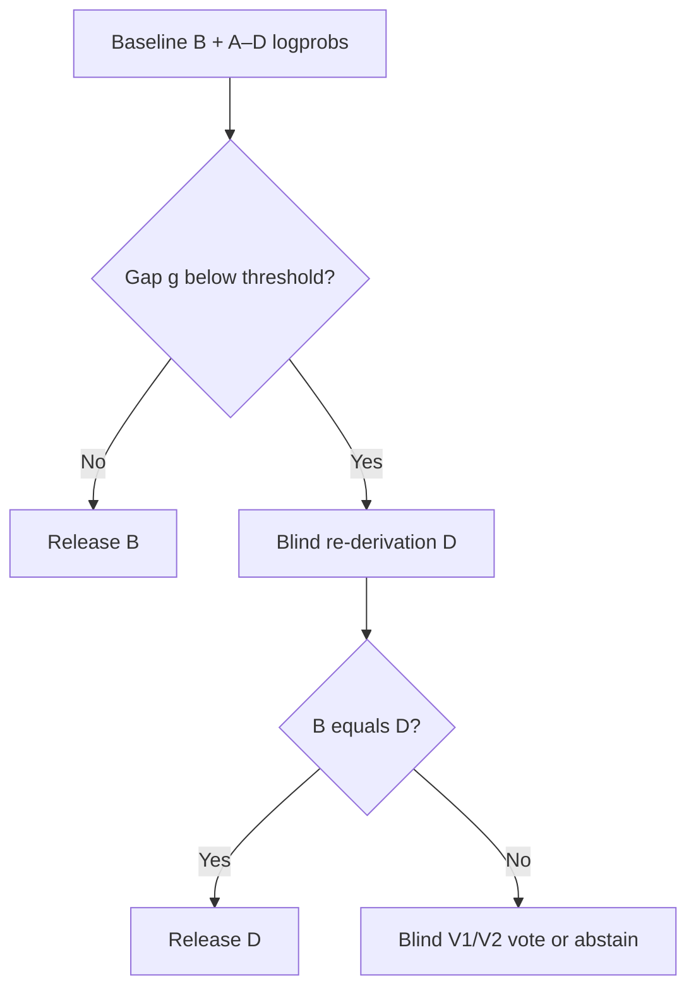

# CCRC — Causal Contrastive Reasoning Control

An experimental, measurement-first framework for studying and selectively controlling **context-induced instability in language-model decisions**.

**Status (2026-08-25): active, early-stage research—not a production safety system.** The current v0.6.0 study is preregistered but has no finalized results in this repository yet.

I opened this work because the full research path may be useful to others: not only the positive findings, but also the failed interventions, narrowed hypotheses, frozen decision gates, and reproducibility artifacts. CCRC is intended to be inspected, challenged, replicated, and improved.

## What CCRC is

CCRC asks whether a model's decision can be made more robust to irrelevant or misleading context without making the system blindly contrarian or universally invoking a costly second pass.

The target is **conditional invariance**:

- remain stable when context should not change the answer;
- remain updateable when new evidence should change it;
- detect likely fragility without treating confidence as truth;
- intervene only where the expected repair value exceeds harms and added inference cost.

CCRC is therefore not a single prompt. It is a research architecture:

1. Measure paired model states under controlled contextual changes.
2. Decompose social framing from directional answer suggestions.
3. Track both final-answer flips and A/B/C/D log-probability movement.
4. Test candidate actuators on held-out data.
5. Promote only interventions that produce more repairs than harms under frozen rules.
6. Preserve manifests, runtime identity, raw runs, validation reports, and hash ledgers.

## Current controller under test

The present candidate uses the baseline top-two answer-logprob gap as a **fragility sensor, not a correctness judge**. Low-margin cases receive a stateless blind re-derivation. Disagreements escalate to two neutral, answer-blind verifiers using distinct option permutations.



On disagreement, the baseline is excluded from the final majority vote: `{D, V1, V2}`. No majority produces an abstention. This controller is **being evaluated**, not claimed as validated.

## Evidence so far

Results below are specific to the stated models, quantizations, benchmarks, prompts, and runtimes. Studies using different samples are not direct head-to-head comparisons.

| Stage | Design | Main result | Gate decision |
|---|---|---|---|
| [Syco30 / v0.1.3](./Syco30_Qwen2.5_PostRun_Analysis_v1.md) | 30 SycoBench items; Qwen2.5-7B Q4_K_M | Baseline accuracy 83.3%; pressure-robust accuracy 26.7%. Baseline answer margin strongly predicted later context-induced changes. | Susceptibility measurable; sensor exploratory; causal intervention blocked. |
| [Cross-model / v0.2.0](./Syco30_Qwen35_CrossModel_Analysis_v1_1_CORRECTED.md) | Same 30 items; Qwen3.5-9B Q4_K_M | Baseline accuracy remained 83.3%; pressure-robust accuracy rose to 50.0%. Susceptibility was attenuated, and the margin relationship replicated. | Advance to matched causal decomposition. |
| [Decomp30 / v0.3.0](./CCRC_Decomp30_Gate_Analysis_v1.md) | 30 questions × 3 template families × 6 conditions; 540 runs | A wrong directional verdict caused the dominant shift (`V-F = +7.663` logP units on the primary endpoint). Authority alone mainly flattened confidence; authority did not reliably amplify the verdict. | Narrow the causal claim; unblock only a bounded verdict-contamination M5 test. |
| [Review160 / v0.4.0](./CCRC_Review160_HeldOut_Gate_Analysis_v1.md) | 160-item held-out SycoBench slice; 1,280 runs | Visible self-review repaired 0/48 initial errors. Preregistered M5 at `γ=1` produced a net `+1/160` decision gain; its interval included zero. | Reject visible constructive review and do not promote M5. |
| [Blind80 / v0.5.0](./CCRC_Blind80_Gate_Analysis_v1.md) | 80 fresh semantic stems; 560 runs | Hiding the prior answer produced 4 repairs and 2 harms. Blind D0 accuracy was 71.25% versus 68.75% for visible-self S0; the paired interval included zero. | Blind re-derivation is a de-anchoring actuator, not a truth detector. Test sensor-gated use next. |
| [I5 × gated controller / v0.6.0](./ccrc_i5gated_harness_v0_6_0_qwen35/PREREGISTRATION.md) | Frozen 2×2 design on 1,000 subject-balanced MMLU items | Tests a compact five-principle instruction layer independently and in combination with the sensor-gated blind verifier. | **Pending. No outcome claim yet.** |

### Findings currently supported

- Misleading context can cause large, repeatable decision and logprob movement.
- An explicit directional verdict was the dominant harmful component in the matched decomposition; authority identity was smaller and qualitatively different.
- Showing a model its own prior answer can create strong self-conditioning inertia, including on wrong answers.
- Hiding the prior answer causes de-anchoring that can repair or harm; it does not reveal truth by itself.
- The baseline A/B/C/D margin is a useful candidate routing signal, but must never be interpreted as proof of correctness.

### Claims not supported

- A universal “authority vector” or general latent bias direction.
- Objective truth recovery from contrastive decoding.
- A general hallucination fix, alignment method, or safety certification.
- Production promotion of M5, unconditional blind re-derivation, or the current consensus verifier.
- Generalization beyond the tested finite-choice settings, models, and benchmark slices.

## M5: tested, not promoted

M5 is the name used here for a local paired-state contrastive correction candidate:

$$
\Delta_t^{(k)} = z_t^{(k)} - z_t^{(0)}, \qquad
z_t^* = z_t^{(0)} - \sum_k \gamma_k \Delta_t^{(k)}
$$

The observed difference $\Delta$ is conditional on the paired prompts; it is **not** assumed to be a pure or universal bias vector. A candidate-level held-out test at `γ=1` failed its promotion gate, so the repository does not justify implementing M5 as a live decoder.

## Repository map

| Path | Purpose |
|---|---|
| Root `*_Analysis_*.md` files | Human-readable findings and gate decisions. Start here for the evidence. |
| `ccrc_syco30_harness_v0_1_*` | Early SycoBench harness iterations and the Qwen2.5 baseline study. |
| `ccrc_syco30_harness_v0_2_0_qwen35` | Frozen Qwen3.5 cross-model replication. |
| `ccrc_decomp30_harness_v0_3_0_qwen35` | Matched authority/verdict/paraphrase decomposition. |
| `ccrc_review160_harness_v0_4_0_qwen35` | Held-out visible-review and M5 gate. |
| `ccrc_blind80_harness_v0_5_0_qwen35` | Prior-answer visibility and blind re-derivation study. |
| `ccrc_i5gated_harness_v0_6_0_qwen35` | Current I5 × sensor-gated consensus-verifier experiment. |
| `*.zip` | Archived package snapshots retained for provenance; the unpacked directories are easier to inspect. |

For the Review160 report, use [`CCRC_Review160_HeldOut_Gate_Analysis_v1.md`](./CCRC_Review160_HeldOut_Gate_Analysis_v1.md); the root file carrying ` (1)` is a byte-identical archival duplicate.

## Reproduce the current experiment

The v0.6.0 harness requires Python 3.10+, a local LM Studio server, Responses API transport with A/B/C/D candidate logprobs, and the exact model/runtime profile described in its config. Read the [preregistration](./ccrc_i5gated_harness_v0_6_0_qwen35/PREREGISTRATION.md) before running.

```bash
git clone https://github.com/chriscustaa/CCRC.git
cd CCRC/ccrc_i5gated_harness_v0_6_0_qwen35

python -m venv .venv
# Windows: .venv\Scripts\activate
# macOS/Linux: source .venv/bin/activate

python -m pip install -U pip
pip install -r requirements.txt
cp config.example.json config.json
```

Set `model_id` in `config.json` to the exact LM Studio model key, then run the tests and frozen workflow:

```bash
pytest -q
mkdir -p experiment_i5gated1000

python -m harness.cli doctor --config config.json --out experiment_i5gated1000/doctor.json
python -m harness.cli transport-check --config config.json --out experiment_i5gated1000/transport_check.json
python -m harness.cli prepare --config config.json --experiment-dir experiment_i5gated1000
python -m harness.cli run --config config.json --experiment-dir experiment_i5gated1000
python -m harness.cli summarize --config config.json --experiment-dir experiment_i5gated1000
python -m harness.cli validate --config config.json --experiment-dir experiment_i5gated1000
python -m harness.cli finalize --config config.json --experiment-dir experiment_i5gated1000
```

The run is resumable by `run_key`. `FINALIZED.json` is emitted only after validation passes.

### Exact reproduction versus extension

To reproduce the registered study, preserve the pinned model revision, tokenizer/runtime behavior, quantization, dataset revision, selection algorithm, prompts, thresholds, seeds, and reasoning-OFF requirement.

If you change any of those, treat the work as a **new replication**:

1. assign a new experiment and harness version;
2. write and freeze a new preregistration before inspecting outcomes;
3. retain the original run unchanged;
4. report repairs, harms, abstentions, coverage, inference calls, and paired uncertainty—not accuracy alone;
5. publish the manifest, raw JSONL, validation output, and SHA-256 ledger.

## Contributing replications

Issues and replication reports are welcome, especially:

- replications on other model families, sizes, or quantizations;
- open-ended task adaptations that preserve blind evaluation;
- independent audits of selection, leakage, logprob capture, and hash provenance;
- alternative fragility sensors evaluated on genuinely held-out data;
- verifier designs that measure net repairs after verification and include their full call cost.

Please separate preregistered outcomes from exploratory analysis and report negative results. A failed promotion gate is useful evidence here, not a failed contribution.

## Upstream data and tools

- Early experiments adapt the public [SycoBench-600](https://github.com/debu-sinha/sycobench-600) protocol. Its code is MIT; its dataset and raw-log artifacts are CC BY 4.0. The dataset is fetched at runtime and is not vendored here.
- The current study fetches [`cais/mmlu`](https://huggingface.co/datasets/cais/mmlu) at its pinned revision. Re-check upstream terms before changing the revision or distribution source.
- Experiments were designed for local inference through LM Studio. Model licenses and runtime behavior remain separate upstream dependencies.

## Citation

Until formal citation metadata is added, cite the repository as:

> Custer, Chris. *CCRC: Causal Contrastive Reasoning Control*. Experimental research repository, 2026. https://github.com/chriscustaa/CCRC

When citing a result, also identify the exact analysis file, experiment ID, model, quantization, and commit used.

## License

No repository-wide license has been declared yet. Public visibility permits inspection, but does not itself grant permission to copy, modify, or redistribute the CCRC code or documentation. The `LICENSE_NOTES.md` files describe upstream dataset terms only. Until a root license is added, contact the repository owner before reuse beyond what applicable law permits.
